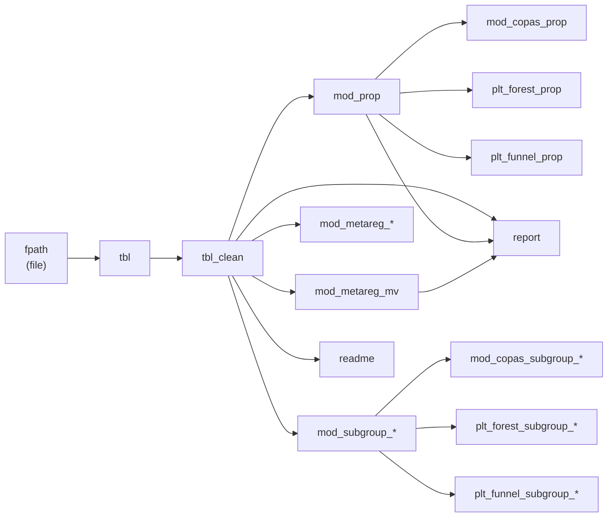

The pipeline is declared entirely in `_targets.R` using the [`targets`](https://docs.ropensci.org/targets/) package. `targets` tracks every input and output as a node in a directed acyclic graph (DAG), so it only reruns the targets whose upstream dependencies have changed. This makes the analysis reproducible, auditable, and efficient: you can interrupt a run, change a single upstream target, and `tar_make()` will recompute only the affected downstream nodes.

## Pipeline targets

The following targets are defined in `_targets.R`. They are listed in topological order — each target depends only on targets that appear before it.

| Target | Type | Description |
|---|---|---|
| `fpath` | file | Path to `data/raw/data.csv`, tracked as a file dependency |
| `tbl` | data frame | Raw data read from `fpath` via `readData()` |
| `tbl_clean` | data frame | Standardized data frame produced by `clean(tbl)` |
| `mod_prop` | model | Overall random-effects meta-analysis of proportions |
| `mod_copas_prop` | model | Copas selection model applied to `mod_prop` |
| `plt_forest_prop` | plot | Forest plot saved to `docs/figures/meta-analysis-prevalence.pdf` |
| `plt_funnel_prop` | plot | Funnel plot for the overall model |
| `mod_subgroup_*` | model | Subgroup meta-analysis for each variable in `uni_vars` |
| `mod_copas_subgroup_*` | model | Copas-adjusted model for each subgroup |
| `plt_forest_subgroup_*` | plot | Forest plot for each subgroup, saved to `docs/figures/` |
| `plt_funnel_subgroup_*` | plot | Funnel plot for each subgroup |
| `mod_metareg_*` | model | Univariable meta-regression for each variable in `uni_vars` |
| `mod_metareg_mv` | model | Multivariable meta-regression using all variables in `mv_vars` |
| `report` | document | Compiled Quarto PDF report from `docs/report.qmd` |
| `readme` | document | Rendered `README.qmd` (lowest priority, runs last) |

The subgroup and univariable meta-regression targets are generated dynamically using `tar_map()` over the `uni_vars` vector:

```r
uni_vars <- c(
  "Age", "Continent", "Setting", "JBI_Classification", "use_guideline"
)
```

The multivariable meta-regression uses a wider set of predictors:

```r
mv_vars <- c(
  "Year", "JBI_Classification", "use_guideline", "Setting", "Continent",
  "Sample_size"
)
```

## Pipeline DAG

The diagram below shows how targets flow from raw data to final outputs.



## Pipeline configuration

The full `tar_option_set()` block from `_targets.R`:

```r
tar_option_set(
  packages   = pkgs,
  error      = "continue",
  memory     = "transient",
  controller = crew_controller_local(worker = 4),
  storage    = "worker",
  retrieval  = "worker",
  garbage_collection = TRUE
)
```

Each option controls a specific aspect of pipeline behavior:

| Option | Value | Effect |
|---|---|---|
| `packages` | `magrittr`, `targets`, `tarchetypes`, `crew` | Loaded in every worker before a target runs |
| `error` | `"continue"` | A failing target marks itself as errored but does not halt the rest of the pipeline |
| `memory` | `"transient"` | Target objects are removed from memory after they are no longer needed by downstream targets |
| `controller` | `crew_controller_local(worker = 4)` | Spawns up to 4 parallel local R worker processes |
| `storage` | `"worker"` | Workers write results directly to the `_targets/` store without routing through the main process |
| `retrieval` | `"worker"` | Workers read upstream dependencies directly from the store |
| `garbage_collection` | `TRUE` | Calls `gc()` after each target to release memory promptly |

## Parallel execution

The pipeline uses [`crew`](https://wlandau.github.io/crew/) to manage parallel workers. The controller is configured with:

```r
crew_controller_local(worker = 4)
```

This spawns up to four background R processes on the local machine. `targets` dispatches independent targets — such as the five `mod_subgroup_*` targets or the five `mod_metareg_*` targets — to available workers concurrently. Because `storage = "worker"` and `retrieval = "worker"` are both set, workers communicate directly with the `_targets/` object store rather than sending large data objects through the main R session. This avoids the serialization bottleneck that would otherwise occur when transferring model objects between processes.

<Note>
The `memory = "transient"` and `garbage_collection = TRUE` settings work together with parallel execution to keep per-worker memory usage low when fitting many subgroup models simultaneously.
</Note>

## Next steps

<CardGroup cols={2}>
  <Card title="Data preparation" icon="table" href="/pipeline/data-preparation">
    Learn how to format and place your input CSV, and how the `clean()` function standardizes variables before modeling.
  </Card>
  <Card title="Running the workflow" icon="play" href="/pipeline/targets-workflow">
    Commands for running, inspecting, and troubleshooting the targets pipeline.
  </Card>
</CardGroup>
